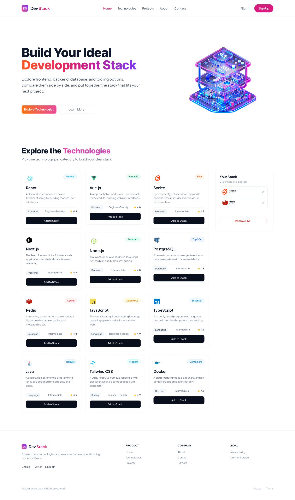

<div align="center">

# ⚡ DevStack

### *Architect, Compare & Assemble Your Ideal Development Stack*

[](https://razzak-dev007.github.io/DevStack-React-Tailwind/)
[](https://github.com/razzak-dev007/DevStack-React-Tailwind)
[](https://react.dev/)
[](https://tailwindcss.com/)
[](https://vitejs.dev/)
[](LICENSE)

<br />

**[Explore Live Demo](https://razzak-dev007.github.io/DevStack-React-Tailwind/) • [View GitHub Repository](https://github.com/razzak-dev007/DevStack-React-Tailwind) • [Report Bug](https://github.com/razzak-dev007/DevStack-React-Tailwind/issues)**

<br /><br />



</div>

---

## 📖 Overview

**DevStack** is an intuitive, modern developer platform and visual architecture planner created to streamline the way software engineers, tech leads, and students explore, compare, and assemble optimal technology stacks. 

Whether you are kickstarting a rapid prototype, designing an enterprise-grade microservice ecosystem, or learning modern web development frameworks, **DevStack** gives you instant visual clarity and curated blueprints to build faster and smarter.

---

## 🚀 Key Features

### 1. 🎛️ Interactive Stack Builder & Dynamic Management
- **One-Click Assembly**: Seamlessly browse and add technologies across Frontend, Backend, Database, DevOps, and Programming Languages into your active stack.
- **Smart Duplicate Prevention**: Automated duplicate detection with intuitive visual warning toasts so your stack remains clean and conflict-free.
- **Dedicated Stack Drawer**: View all chosen tools in an interactive sidebar summary, complete with quick-removal triggers and a single-click "Clear All" action.

### 2. 🏛️ Curated Architectural Presets
- **Industry-Standard Templates**: Load battle-tested preset stacks with one click, including:
  - **Modern Full-Stack Web**: React, Tailwind CSS, Node.js, PostgreSQL, TypeScript, Git.
  - **Serverless Edge & Microservices**: Next.js, GraphQL, Redis, Docker, TypeScript, Git.
  - **Reactive & Real-Time App**: Vue.js, Node.js, MongoDB, Docker, JavaScript, Git.
- **Targeted Insights**: Each preset comes with curated compatibility badges, difficulty ratings, and descriptive use-case summaries.

### 3. 💾 Real-Time Persistence & Visual Analytics
- **Zero-Loss Session Sync**: Automatically persists your configured tech stack to `localStorage`, allowing you to resume your architecture workflow anytime without data loss.
- **Multi-Category Filtering**: Instant, lag-free filtering across Frontend, Backend, Database, and DevOps categories.
- **Interactive Toast Feedback**: Elegant notifications powered by React Toastify for every user interaction.

---

## 🛠️ Technology Stack

| Domain | Technologies Used |
|---|---|
| **Core Framework** | [React 18](https://react.dev/) (Hooks, Memoization, State Management) |
| **Styling & Design System** | [Tailwind CSS 3](https://tailwindcss.com/) & [DaisyUI 4](https://daisyui.com/) |
| **Bundler & Build Tool** | [Vite 5](https://vitejs.dev/) |
| **Icons & Visuals** | [Lucide React](https://lucide.dev/) & [Devicon SVG Assets](https://devicon.dev/) |
| **Notifications** | [React Toastify](https://fkhadra.github.io/react-toastify/) |
| **Typography** | Plus Jakarta Sans & Inter (Google Fonts) |
| **Deployment & CI/CD** | GitHub Pages & GitHub Actions |

---

## 📂 Project Structure

```text
DevStack-React-Tailwind/
├── .github/
│   └── workflows/
│       └── deploy.yml          # Automated CI/CD deployment workflow
├── public/
│   ├── assets/                 # Brand graphics and logos
│   └── technologies.json       # Structured technology catalog dataset
├── src/
│   ├── assets/                 # Hero banners and UI visual assets
│   ├── components/
│   │   ├── Footer.jsx          # Rich footer with brand links
│   │   ├── Hero.jsx            # Hero banner & value proposition
│   │   ├── MobileNavbar.jsx    # Responsive mobile drawer navigation
│   │   ├── Navbar.jsx          # Fixed desktop navigation bar
│   │   ├── TechCard.jsx        # Interactive technology card component
│   │   ├── TechGrid.jsx        # Filterable technology matrix
│   │   └── YourStack.jsx       # Real-time stack summary drawer
│   ├── App.jsx                 # Root component & architecture state
│   ├── index.css               # Global styles & Tailwind directives
│   └── main.jsx                # Application DOM entrypoint
├── index.html                  # HTML5 boilerplate & SEO metadata
├── package.json                # Project dependencies and npm scripts
├── tailwind.config.js          # Tailwind theme & color configurations
└── vite.config.js              # Vite configuration & asset routing
```

---

## ⚡ Getting Started

Follow these simple steps to run DevStack locally on your machine:

### Prerequisites
- **Node.js** (v18.0.0 or higher recommended)
- **npm** (v9.0.0 or higher) or **yarn** / **pnpm**

### Installation

1. **Clone the repository:**
   ```bash
   git clone https://github.com/razzak-dev007/DevStack-React-Tailwind.git
   ```

2. **Navigate into the project directory:**
   ```bash
   cd DevStack-React-Tailwind
   ```

3. **Install dependencies:**
   ```bash
   npm install
   ```

4. **Start the local development server:**
   ```bash
   npm run dev
   ```

5. **Open your browser:**
   Navigate to `http://localhost:5173` to start exploring and assembling your stack!

---

## 📜 Available Scripts

| Command | Purpose |
|---|---|
| `npm run dev` | Starts the Vite development server with hot-module reloading. |
| `npm run build` | Compiles and optimizes the React application for production into `dist/`. |
| `npm run preview` | Runs a local web server to preview the production build output. |

---

## 🌐 Links

- **GitHub Repository Link:** [https://github.com/razzak-dev007/DevStack-React-Tailwind](https://github.com/razzak-dev007/DevStack-React-Tailwind)
- **Live Site Link:** [https://razzak-dev007.github.io/DevStack-React-Tailwind/](https://razzak-dev007.github.io/DevStack-React-Tailwind/)

---

## 📄 License

This project is licensed under the [MIT License](LICENSE) — feel free to use it for personal and commercial projects.

---

<div align="center">
  <sub>Built with ❤️ by <a href="https://github.com/razzak-dev007">Md Abdur Razzak</a></sub>
</div>
